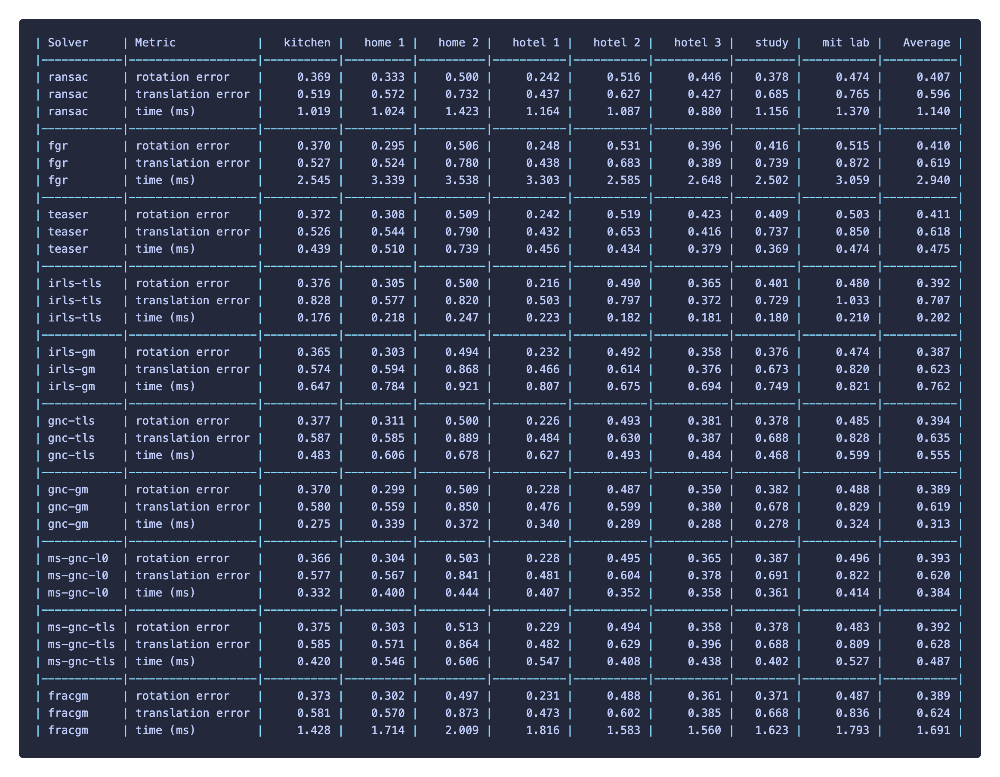

# Geman-McClure Robust Registration

[](https://github.com/llvm/llvm-project/releases/tag/llvmorg-18.1.3)
[](https://github.com/astral-sh/ruff)


**About**

Official implementation of my master thesis "Algorithms for Geman-McClure Robust Estimation and Applications for Spatial Perceptions". This library is written in **C++** and we support **Python** interface.

**Table of Contents**

- [Geman-McClure Robust Registration](#geman-mcclure-robust-registration)
  - [:gear: Setup](#gear-setup)
    - [Prerequisites](#prerequisites)
    - [Build](#build)
    - [(optional) Build with Python binding](#optional-build-with-python-binding)
  - [:books: Example usages](#books-example-usages)
  - [:video\_game: Numerical results](#video_game-numerical-results)
  - [:card\_file\_box: Related works](#card_file_box-related-works)

## :gear: Setup

The following setup is tested in Ubuntu 22.04.

### Prerequisites
```shell
sudo apt update
sudo apt install -y g++ build-essential cmake
sudo apt install -y libeigen3-dev libomp-dev
```


### Build

```shell
mkdir build
cd build
cmake .. 
make
```

### (optional) Build with Python binding
```shell
sudo apt install -y python3 python3-dev python3-venv
python3 -m venv .venv
source .venv/bin/activate
python3 -m pip install --upgrade pip
python3 -m pip install numpy

mkdir build
cd build
cmake .. -DBUILD_PYTHON=ON
make

cd python && pip install .
```

## :books: Example usages

We provide the following robust point cloud registration solvers:

| Solver       | Robust      | Description                                                       |
|--------------|-------------|-------------------------------------------------------------------|
| IrlsSolver   | TLS, GM     | IRLS-based registration solver with linear relaxation approach.   |
| GncSolver    | TLS, GM, L0 | GNC-based registration solver with linear relaxation approach.    |
| FracgmSolver | GM          | FracGM-based registration solver with linear relaxation approach. |

> Note that QGM is IrlsSolver with the Geman-McClure robust function.

- [:croissant: C++](examples/cpp)
- [:snake: Python](examples/python)

Implementation of other solvers used in the synthetic dataset experiments can be found [here](https://github.com/doggydoggy0101/registration). 


## :video_game: Numerical results

We benchmark the solvers against [RANSAC](https://github.com/isl-org/Open3D), [FGR](https://github.com/isl-org/FastGlobalRegistration), and [TEASER++](https://github.com/MIT-SPARK/TEASER-plusplus) on the [3DMatch](https://3dmatch.cs.princeton.edu/) dataset.




## :card_file_box: Related works

- Bang-Shien Chen, Yu-Kai Lin, Jian-Yu Chen, Chih-Wei Huang, Jann-Long Chern, Ching-Cherng Sun. **FracGM: A Fast Fractional Programming Technique for Geman-McClure Robust Estimator**. _IEEE Robotics and Automation Letters (RA-L)_, vol. 9, no. 12, pp. 11666-11673, 2024. ([paper](https://doi.org/10.1109/lra.2024.3495372)) ([preprint](https://arxiv.org/pdf/2409.13978)) ([code](https://github.com/StephLin/FracGM))

- Liangzu Peng, Christian Kümmerle, René Vidal, **On the convergence of IRLS and its variants in outlier-robust estimation**. _In Proceedings of the IEEE/CVF Conference on Computer Vision and Pattern Recognition_, pp. 17808-17818, 2023. ([paper](https://doi.org/10.1109/CVPR52729.2023.01708)) ([preprint](https://openaccess.thecvf.com/content/CVPR2023/papers/Peng_On_the_Convergence_of_IRLS_and_Its_Variants_in_Outlier-Robust_CVPR_2023_paper.pdf)) ([code](https://github.com/liangzu/IRLS-CVPR2023))

- Heng Yang, Pasquale Antonante, Vasileios Tzoumas, Luca Carlone. **Graduated Non-Convexity for Robust Spatial Perception: From Non-Minimal Solvers to Global Outlier Rejection**. _IEEE Robotics and Automation Letters_, vol. 5, no. 2, pp. 1127-1134, 2020. ([paper](https://doi.org/10.1109/LRA.2020.2965893))([preprint](https://arxiv.org/pdf/1909.08605))([code](https://github.com/MIT-SPARK/GNC-and-ADAPT))